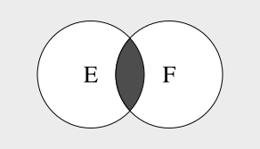
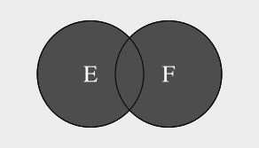
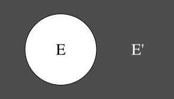

# Probability

A trial, experiment or observation is an event with an unknown outcome.  All
possible outcomes of the trial are called the sample space, and the particular
outcomes being looked for are known as events.  For example, if the trial is
flipping a coin the sample space is heads or tails.  If the trial is rolling a
six sided die, looking for an odd number, the sample space is
`{1, 2, 3, 4, 5, 6}` and the events are `{1, 3, 5}`.  Trials are considered
independent if the outcome of one doesn't affect the others, and events are
considered mutually exclusive if they cannot occur at the same time.

The probability of an event is always between 0 and 1.  Zero indicates that
there is no chance of the event occuring, whilst one means that the event is
certain to occur.  Probability statements are usually written as $P(E) = 0.25$,
meaning that the probability of event $E$ occuring is 0.25, or 25%.  The
probability that event E will occur given the occurence of event F is usually
written as $P(E|F)$.  If the two events were independent $P(E|F) = P(E)$ would
be true.

## Intersection

A compound event that occurs when *all* of its constituent events occur.

$$
\begin{align}
E & = \{1, 3\} \\
F & = \{1, 2\} \\
E \cap F & = \{1\}
\end{align}
$$

If the events are independent the probability of the intersection is the product
of the probabilities for all of the events.

$$P(E \cap F) = P(E)P(F)$$

If the events are not independent we multiply by the conditional probability.

$$P(E \cap F) = P(E)P(F|E)$$

## Union

A compound event that occurs if *at least one* of its constituent events has
occurred.

$$
\begin{align}
E & = \{1, 3\} \\
F & = \{1, 2\} \\
E \cup F & = \{1, 2, 3\}
\end{align}
$$

If the events are mutually exclusive the probability of the union is the sum of
the probabilities for all of the events.

$$P(E \cup F) = P(E) + P(F)$$

If the events aren't mutually exclusive we need to account for any
intersection.

$$P(E \cup F) = P(E) + P(F) - P(E \cap F)$$

## Complement

All outcomes in the sample space that are not part of the event.

$$
\begin{align}
\text{Sample Space} & = \{1, 2, 3, 4, 5, 6\} \\
E & = \{1, 3\} \\
E' & = \{2, 4, 5, 6\}
\end{align}
$$

The complement can also be denoted with $\bar{E}$ or $E^c$.  An event and its
complement define a Bernoulli trial.

## Permutations and Combinations

The number of permutations of subsets of size $k$, drawn from a set of size $n$:

$$nPk = \frac{n!}{(n - k)!}$$

The number of combinations:

$$nCk = \frac{n!}{k!(n-k)!} = \frac{nPk}{k!}$$

There are always fewer combinations than permutations because a different order
of the same elements is a different permutation, but not a different combination.